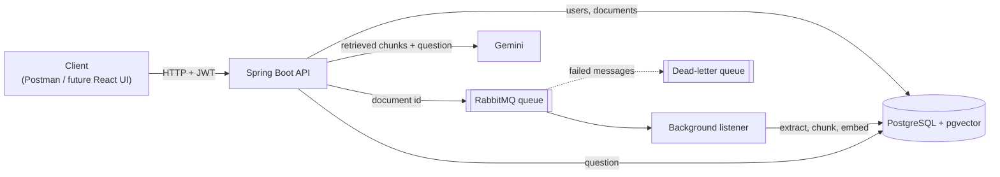
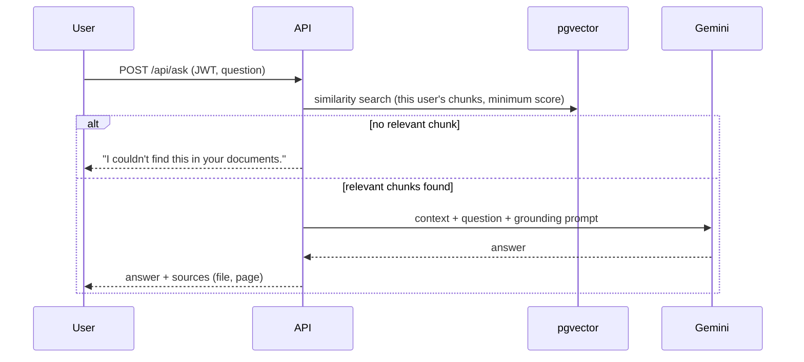

# DocMind: AI document assistant (RAG)

Upload PDFs, then ask questions about them. DocMind answers **using only your documents** and cites the file and page of every source. If nothing relevant is found, it says so instead of inventing an answer.

> **Status:** work in progress. The backend is complete and working. Automated tests, CI, a containerized app image and a React front-end are on the roadmap below.

## What it does

- Secure accounts: registration, login, JWT-protected API
- PDF upload that returns **instantly**; processing runs in the background
- Semantic search over each user's documents (by meaning, not keywords)
- Question answering with **source citations** (file + page)
- Strict per-user isolation: you can only search and ask about your own documents

## Architecture



### Upload and processing

1. The API stores the file on disk under a random name and saves a database row with status `UPLOADED`.
2. It publishes the document id to RabbitMQ and returns `201` immediately.
3. A listener reads the PDF page by page, splits the text into chunks of about 150 words with 30 words of overlap, creates a 384-dimension embedding for each chunk with a local model, and stores them in pgvector.
4. The status moves `UPLOADED` → `PROCESSING` → `READY`. On failure it becomes `FAILED` and the message goes to a dead-letter queue.

### Asking a question



## Tech stack

| Area | Technology |
|---|---|
| Language / framework | Java 21, Spring Boot 4 |
| Database | PostgreSQL 16 with pgvector |
| Security | Spring Security, JWT (jjwt), BCrypt |
| Messaging | RabbitMQ (queue + dead-letter queue) |
| PDF parsing | Apache PDFBox |
| Embeddings | Local ONNX model (all-MiniLM-L6-v2) via Spring AI |
| Answer generation | Google Gemini via Spring AI |
| Infrastructure | Docker Compose |

## Getting started

### Prerequisites

- JDK 21
- Docker Desktop
- A Gemini API key from [Google AI Studio](https://aistudio.google.com)

### Run

```bash
# 1. Start PostgreSQL (pgvector) and RabbitMQ
docker compose up -d

# 2. Provide your Gemini API key (never commit it)
export GEMINI_API_KEY="your-key"          # Windows PowerShell: $env:GEMINI_API_KEY = "your-key"

# 3. Start the API
./mvnw spring-boot:run                    # Windows: .\mvnw spring-boot:run

# 4. Check it is up
curl http://localhost:8080/api/health
```

Tables (including the vector table) are created automatically on first start. The first start can take a few minutes because the embedding model is loaded.

### Try it

On Windows, use `curl.exe` instead of `curl`.

```bash
# Register and log in
curl -X POST http://localhost:8080/api/auth/register -H "Content-Type: application/json" \
     -d '{"email":"you@example.com","password":"password123"}'
curl -X POST http://localhost:8080/api/auth/login -H "Content-Type: application/json" \
     -d '{"email":"you@example.com","password":"password123"}'
# -> {"token":"eyJ..."}   (set TOKEN to that value)

# Upload a PDF (returns immediately with status UPLOADED)
curl -X POST http://localhost:8080/api/documents -H "Authorization: Bearer $TOKEN" -F "file=@document.pdf"

# Wait a few seconds, then check the status (READY once processed)
curl http://localhost:8080/api/documents -H "Authorization: Bearer $TOKEN"

# Ask a question
curl -X POST http://localhost:8080/api/ask -H "Authorization: Bearer $TOKEN" \
     -H "Content-Type: application/json" -d '{"question":"What are the main points?"}'
```

Example response (illustrative):

```json
{
  "answer": "The document lists communication, teaching skills and adaptability.",
  "sources": [{ "filename": "document.pdf", "page": 2, "score": 0.39 }]
}
```

RabbitMQ management UI: http://localhost:15672 (development credentials `docmind` / `docmind`).

## API overview

| Method | Endpoint | Description |
|---|---|---|
| POST | `/api/auth/register` | Create an account |
| POST | `/api/auth/login` | Get a JWT |
| GET | `/api/me` | Current user (auth check) |
| POST | `/api/documents` | Upload a PDF (processed in the background) |
| GET | `/api/documents` | List your documents and their status |
| POST | `/api/documents/{id}/process` | Re-queue a failed document |
| GET | `/api/documents/search?q=` | Semantic search over your documents |
| POST | `/api/ask` | Ask a question, get an answer with sources |
| GET | `/api/health` | Health check |

## Configuration

| Setting | Where | Purpose |
|---|---|---|
| `GEMINI_API_KEY` | environment variable | Gemini access |
| `JWT_SECRET` | environment variable | JWT signing secret (a development default exists; set your own for any real use) |
| `spring.ai.google.genai.chat.model` | `application.properties` | Gemini model to use |
| `app.rag.top-k` / `app.rag.min-score` | `application.properties` | Number of chunks retrieved and the minimum similarity score |

## Design decisions and security

- **Passwords:** hashed with BCrypt (slow and salted on purpose).
- **Stateless auth:** JWT with an expiry, verified by a filter on every request.
- **Per-user isolation:** the owner always comes from the token, never from the client, and vector searches filter on `ownerId`.
- **Uploads:** files are stored under random names (prevents path traversal); only PDFs are accepted; the API returns DTOs, not database entities.
- **Grounded answers:** a similarity threshold blocks weak matches before the model is called, and the prompt tells the model to answer only from the retrieved context and to treat document text as data, not instructions (prompt-injection defense).
- **Asynchronous ingestion:** uploads don't wait for heavy processing; the listener is idempotent, and failures are kept in a dead-letter queue.
- **Provider-agnostic AI layer:** the code talks to Spring AI abstractions, so the model provider can be swapped through configuration.
- **Secrets:** API keys come from environment variables, never from the repository.

## Known limitations

- A crash in the middle of processing can leave a document in `PROCESSING`; a timeout or recovery job is not implemented yet.
- The local embedding model is English-oriented; a multilingual model would rank French documents better.
- Scanned PDFs (images without text) are not supported (no OCR).
- The Gemini free tier has small daily quotas, and free-tier content may be used by Google to improve its products, so avoid sensitive documents.
- The message is published right after the database save; a transactional outbox would make that fully reliable.

## Roadmap

- [x] Authentication (BCrypt, JWT)
- [x] PDF upload and per-user storage
- [x] Chunking, local embeddings, semantic search (pgvector)
- [x] RAG question answering with citations
- [x] Asynchronous processing (RabbitMQ + dead-letter queue)
- [ ] Unit and integration tests (JUnit, Testcontainers)
- [ ] CI pipeline (GitHub Actions)
- [ ] Dockerfile and full Docker Compose (app + database + broker)
- [ ] React front-end (login, upload with statuses, chat with sources)

## Project structure

```
src/main/java/com/nouhaila/docmind/
├── auth/       register/login, JWT service and filter
├── config/     Spring Security and RabbitMQ configuration
├── document/   upload, listing, queue producer/consumer, PDF processing, search
├── rag/        question answering (retrieval + language model)
└── user/       user entity and repository


```

## Troubleshooting (Windows)

- **`There is not enough space on the disk` / ONNX library errors at startup:** the embedding library extracts native files to your temp folder; free some disk space.
- **`onnxruntime.dll: A dynamic link library (DLL) initialization routine failed`:** an older C++ runtime bundled in the JDK's `bin` folder can shadow the system one. If `msvcp140.dll`, `vcruntime140.dll` and
